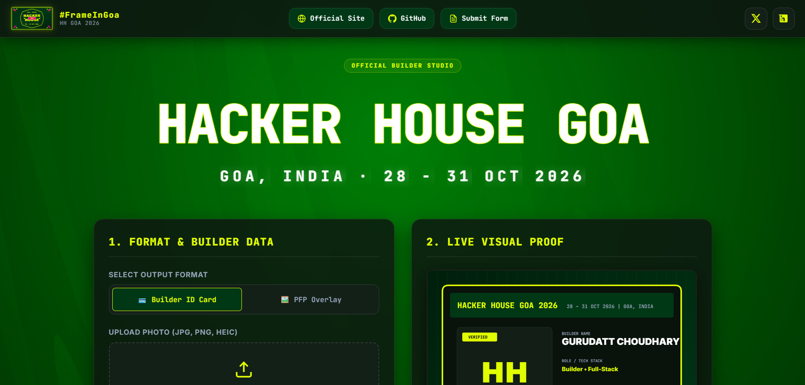

# 🌴 Hacker House Goa 2026 — #FrameInGoa

> **Official Shortlisting Task & Builder ID / PFP Overlay Generator**  
> *"LESS NOISE. MORE SIGNAL."*


---

## ⚡ Executive Overview

Welcome to the official **Hacker House Goa 2026 (#FrameInGoa)** team repository! 

This project is a high-performance, **zero-friction client-side web tool (browser-based website)** built to fulfill the **Stage 1 Open Trials Shortlisting Task** for Hacker House Goa 2026 (Oct 28 – 31, 2026 in Goa, India).

The website works directly in any browser (desktop & mobile) with zero installation required for end-users. Builders can upload their photo, automatically process any file format (JPG, PNG, native iPhone HEIC), auto-crop arbitrary aspect ratios, and instantaneously render branded event visual artifacts formatted for social sharing and profile customisation.

---

## 📸 Output & Application Preview



---

## 🎨 Visual Identity & Design System

The visual aesthetic strictly adheres to the official Hacker House Goa 2026 brand identity:

| Element | Hex / Specs | Preview / Description |
| :--- | :--- | :--- |
| **Primary Theme** | `#003816` | **Deep Cyber Green** — Core background & brand identity |
| **Accent / Highlight**| `#E1FE00` | **Electric Neon Yellow** — Badges, highlights, callouts |
| **Background / Contrast**| `#000000` / `#0D0D0D` | **Obsidian Black** — High contrast structural cards |
| **Typography** | `Inter`, `JetBrains Mono` | Clean sans-serif headings with high-tech monospace metadata |
| **Slogan** | *"LESS NOISE. MORE SIGNAL."* | Brand watermark embedded on all generated artifacts |

---

## 📐 Output Formats

The application powers **three** client-side rendering engines using HTML5 Canvas:

```
         ┌──────────────────────────────────────────────────────┐
         │                  USER PHOTO UPLOAD                  │
         │          (.jpg, .png, .heic via heic2any)            │
         └──────────────┬──────────────────┬───────────────────┘
                        │                  │                  │
                        ▼                  ▼                  ▼
              ╔════════════════╗  ╔════════════════╗  ╔════════════════╗
              ║   FORMAT A     ║  ║   FORMAT B     ║  ║   FORMAT C     ║
              ║  PFP Overlay   ║  ║  Builder ID    ║  ║   X Banner     ║
              ╚════════════════╝  ╚════════════════╝  ╚════════════════╝
              1080×1080px         900×1200px           1500×500px
```

### 1. Format A: PFP Frame / Overlay (1080×1080)
- **Purpose**: Ready-to-use X (Twitter) profile picture overlay.
- **Features**: Full-bleed user photo, neon yellow border frame, branded `#FrameInGoa` pill badge, `HH GOA 2026` stamp.

### 2. Format B: Builder ID Card (900×1200)
- **Purpose**: Digital event credentials & builder passport.
- **Rendered Fields**:
  - **Header**: `HACKER HOUSE GOA` branding + procedural logo + गोवा sticker
  - **User Data**: Cropped Photo + Verified Badge, Full Name, Primary Role, Tech Stack pills.
  - **Dynamic Attributes**: Random builder title, unique serial `#HHG-2026-XXXX`, procedural barcode, QR code
  - **Footer**: `#FrameInGoa`, `hhgoa.com`, serial verification ID

### 3. Format C: X / Twitter Header Banner (1500×500)
- **Purpose**: Profile header / social banner for X (Twitter) — a unique differentiator.
- **Features**: HH Goa branding, गोवा sticker, event date badge, circular avatar (when photo uploaded), builder name/role/title, `#FrameInGoa` tag.

---

## 🛠️ Architecture & Tech Stack

```
[ Architecture      ]   Vanilla HTML5 + Modern CSS3 + Native ES6 JavaScript
[ Styling Engine     ]   Custom CSS (Cyberpunk Dark Mode, Glassmorphism, CSS Variables)
[ Image Processing   ]   HTML5 Canvas API (Client-side GPU accelerated)
[ HEIC Support       ]   heic2any library (iPhone native HEIC image conversion)
[ Export Engine      ]   canvas.toDataURL() / toBlob() + Instant Download
[ Social Integration ]   Web Intent API (Direct pre-populated X Share window)
```

### Core Technical Directives
1. **Zero Friction**: 0 login walls, 0 registration steps, 0 backend API latency.
2. **Instant Native Crop**: Math-based center-crop canvas algorithm to handle landscape, portrait, and wide photos effortlessly.
3. **100% Client-Side Privacy**: Photos are processed entirely inside the user's browser canvas — no external image storage required.
4. **Single-Click Workflow**: A unified CTA button triggers an instant `.png` download **and** launches an X share intent window pre-configured with `#FrameInGoa`.

---

## 📁 Repository Structure

```
hhgoa26-frameingoa/
├── README.md        # Project blueprint & team documentation
├── index.html       # Web application DOM layout & UI structure
├── styles.css       # Custom design system (#003816 green, #E1FE00 neon yellow)
├── script.js        # HTML5 Canvas rendering engine (3 formats)
├── shuffle.js       # GSAP-powered hero text shuffle animation
├── stroke-text.js   # SVG stroke-draw text animation
├── vercel.json      # Vercel static deployment config
└── assets/          # Logos, background images, UI assets
```

---

## 🚀 Quickstart for Team Members

### Prerequisites
- Any modern web browser (Google Chrome, Firefox, Safari, Edge).
- [Vercel CLI](https://vercel.com/cli) for deployment (optional).

### Local Development

```bash
# 1. Clone the repository
git clone https://github.com/ProofLabs/hhgoa26-frameingoa.git
cd hhgoa26-frameingoa

# 2. Run a local dev server
npx serve .
# Access at: http://localhost:3000
```

### Deploy to Vercel

```bash
# Install Vercel CLI
npm i -g vercel

# Deploy (first time — follow prompts)
vercel

# Subsequent deploys
vercel --prod
```

> The `vercel.json` config is already included. Just `vercel --prod` to ship.

---

## 🎯 Selection Criteria & Submission Checklist

This submission is evaluated under **Stage 1 — Open Trials** of the Hacker House Goa 2026 Selection Process.

### 📋 Hard Submission Requirements

- [ ] **Live URL**: Deployed to Vercel at `https://framingoa.vercel.app` ✅
- [ ] **3 Output Formats**: ID Card (900×1200), PFP Overlay (1080×1080), X Banner (1500×500) ✅
- [ ] **HEIC iPhone Support**: Verified working upload for native Apple photos via `heic2any` ✅
- [ ] **Instant Download**: High-res 3× scaled `.png` download, no loading screen ✅
- [ ] **Share to X**: Tweet intent pre-filled with `#FrameInGoa #HackerHouseGoa` + `hhgoa.com` ✅
- [ ] **HHGOA Branding**: `#003816` green, `#E1FE00` neon yellow, official logo, `गोवा` sticker ✅
- [ ] **Official Submission Form**: Submit before **11:59 PM, Aug 13 2026** ([Form Link](https://forms.gle/jM5hTaGvsrfEfixPA))
- [ ] **Team Posts**: Every team member posts their generated graphic on X with `#FrameInGoa`

### 🛡️ Evaluation Signals Addressed
- **Proof of Building**: Hand-coded canvas engine, zero AI-generated art, original design
- **UI/UX Excellence**: Modern dark glassmorphism UI, pulsing action buttons, scanline effects
- **HHGOA Brand Compliance**: Deep green `#003816` + neon yellow `#E1FE00` throughout
- **Edge Case Rigor**: HEIC support, drag-crop modal, responsive layout, fallback downloads

---

## 👥 Team & Credits

- **Team**: **ProofLabs**
- **Event**: Hacker House Goa 2026 (Oct 28–31, 2026 | Goa, India)
- **Hashtag**: `#FrameInGoa`
- **Motto**: *"LESS NOISE. MORE SIGNAL."*

---
*Built by Team ProofLabs for Hacker House Goa 2026 Shortlisting Task — Open Trials Stage 1.*
